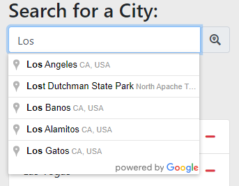
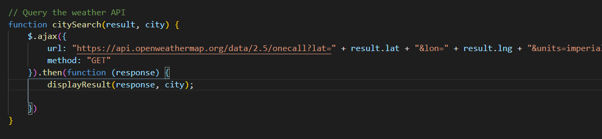
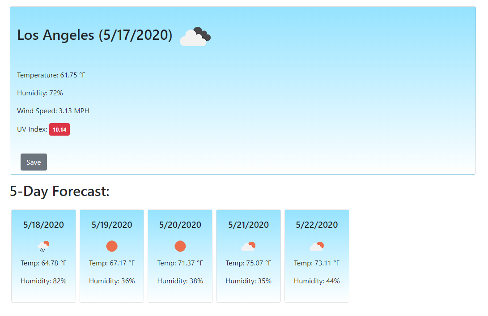
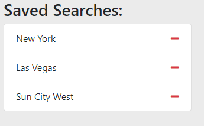

# Weather Dashboard

https://scottsharris-az.github.io/weather-dashboard/

This application is a weather dashboard where a user can use their current location or search for an address or place and receive weather information for that location. Users can save search results for easy access and the application will load up on the last searched result in future uses.

## Searching for a city

When searching for a city, the user has the option to either type an address/place or to use their current device location. The search bar is powered by the google places API and will autocomplete an address for you, making it easier and quicker for the user to obtain their desired results. The current location button will trigger a location request in the browser and use the given coordinates to get the matching results.

## Getting the weather

If the users current location is used, the application will go straight to the citySearch function to query the openweathermap API for the weather at those coordinates. If the search bar is used, the address is first run through the geocodeAddress function. This function uses the google maps API to convert the address into coordinates that can then be run through the citySearch function to get the weather results.

## Displaying the results

The search results are displayed into the main dashboard of the application. The current weather for the specified location is displayed in the main box up top and the 5 day forecast is within the 5 cards underneath. The dates in the application are obtained by moment.js.

Search results can be saved using the save button at the bottom of the dashboard. Saved results can be deleted by either using the same button, which changes based on the state of the result, or by using the 'minus' logo on the saved results list.

Selecting a saved search will display the current results for that location. Saved searches and the most recent search are stored in local storage. This way when a user revisits the application they can pick up exactly where they left off.
